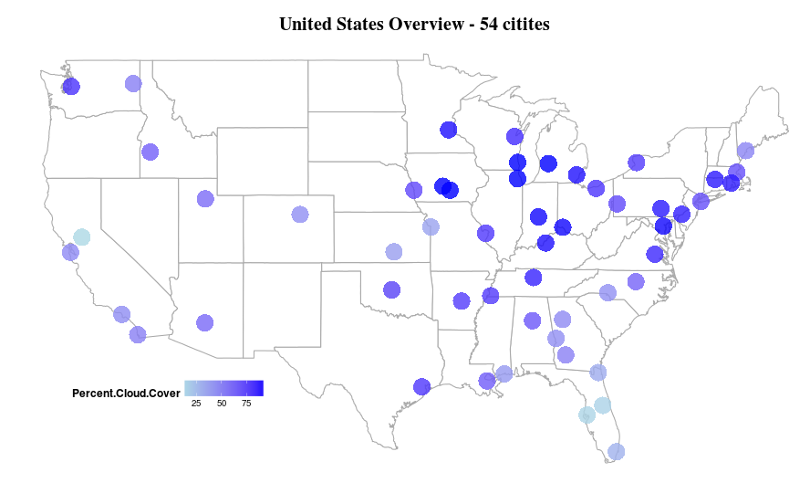
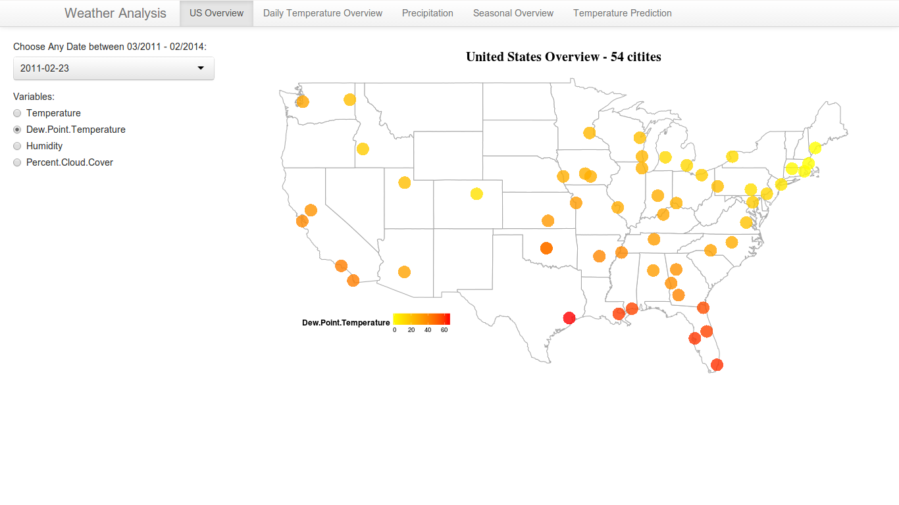

Project: Final
==============================


| **Name**  | Deeksha Chugh  |
|----------:|:-------------|
| **Email** | dchugh@dons.usfca.edu |

## Instructions ##
The following packages must be installed prior to running this code:
```
library(ggplot2)
library(ggmap)
library(maps)
library(randomForest)
library(RCurl)
library(GGally)     
```
To run this code, please enter the following commands in R:
```
library(shiny)
shiny::runGitHub('msan622', 'deekshachugh', subdir = 'final-project')
Please note that the data is fetched from online server so you need to have internet connected when you run this application.
```
## Discussion ##

###Data Preparation ###
 
In order to do this analysis, I scraped the weather data from Wunderground.com. The website provides weather information on the basis of airport code. I mapped the airport codes to get the city name and their latitude and longitude information. I also created a season column by using the months in the data. 

###Project Prototype###
I demonstrated a time series line chart of temperature and dew point temperature with zoomed in version and overview across three years.
Spencer and Prateek suggested me to use selectize input option in my UI becuase I have 54 cities in my data. I impelemented that option and it was really useful because you need not scroll for the city which you want to visualize instead you can type the city and it will show up. Jeremey, Manoj and Trevor all of them suggested to do some heat map visulaization by showing the geography and I was able to implement that my mapping the latitude and longitude of the citites and I am glad that they suggested this.

Trevor also suggested me to show seasonal information about the data. I added a parallel coordinate plot which shows various seasonal patterns in temperature and other weather variables.

I did not implement the outlier analysis suggested by Manoj as I wanted to focus on graphs which can give a bigger view of weather rather than a drilled down approach.


###Challenges###

The biggest challenge for me was to implement brushing in my parallel coordinate plot. I fixed the colors of each season to make it consistent. The problem was that when I de-select any season in my plot then the lines which are grey appears on top of the solid lines which I want to show. I tried to set the alpha level also for the de-selected lines but it was not helpful. I was still not able to implement it. To reduce the effect of grey lines on my solid lines I reduced the alpha level for all the lines and made the grey lines more white in color. 
 
I wanted to implement animation where in you could see how temperature is increasing or decreasing but the shiny interface is not so good. I tried it but the changes are not very smooth.
Another challenge was to get the city names mapping because my dataset had airport codes and I wanted to add city names instead of Airport Codes and that information is not available easily but I somehow managed to do it and added in my dataset.

The wind speed extracted from the wunderground.com had some really abnormal values like -1000 and so on which was really difficult to interpret. I made a lot of visulaizations with wind speed but those outliers were showing a totally odd story which was hard to believe. Therefore, I dropped that variable from my analysis as its better to show less but accurate information.

If I had more time, I would have implemented it in D3 with nice interativity wherein you can have a tooltip to see which point is what temperature or humitdity in all my plots. I think that would have been very useful from user point of view. I could have added more data like weekly flu trends or any product sales data and do some analysis on how temperature is related to it.

### Technique1 ###
###US Weather Overview - 54 Citites (2011-2013)###


The above plot shows the heatmap of temperature across 54 citites in US. Each dot is representative of each city. The color gradient is chosen to be yellow to red as it depicts low to high temperature. The dew point temperature has also the same gradient color. I changed the legend position and direction to have better data-ink ratio. The plot title and the legend title are in bold with increased size so that it is easier to read. The alpha level of the dot is reduced to 0.8 to see the overlapping citites. I thought of adding the value of temperature over the dots but it was not providing any extra information. The idea of the plot is to display holistic view of the data across US. I removed the background panel and made it white so that it merges with the whole application. I tried different sizes of the dots but decided with 9 as appropriate as its not very big and not very small. The lie factor is close to one for this plot. The data density is high in right part of my plot becuase I have more cities from the east part of the country. I think data - ink ratio is superb in this graph as its so amazing to see so many citites in just one plot and make inferences about their weather.

The latitude and longitude information of cities was required to generate this kind of plot. Its easy to find that information for states but it was difficult to find airport code mapping of lat-long. I somehow was able to find that information by secondary research.

I used melt from reshape library to covert this data into long format. The date column was a character column therefore, I also converted to date class so that it shows appropriate date. To show different city I am subsetting my data to use the city specific data of 3 years.
This visualization excels at showing the comparison of temperature or Humidity or Percentage Cloud Cover across so many cities on any particular day of the year. The plot helps in detecting outliers in terms of city. It can answers question like which city was hottest or coldest on any day. If I had more time I would have shown the same plot for different seasons, months and weeks.



The above plot shows the heatmap of Percentage Cloud Cover across 54 citites in US. The color gradient is chosen to be light blue to blue as a depiction of cloud. All the customizations applied on the above plot are also applied here.

#####Interactivity#####

I implemented filtering for date as well as type of variable user is interested in. On the left side of the panel, you can type any date within the three years of date range to see the temperature across all citites for any particular day of the year. 
The radio button is added for user to select the variable which they want to view. The variables included are Temperature, Dew Point Temperature, Humidity and Percent Cloud Cover. 

This kind of interactivity is important so that user can explore what he/she is looking for any particular day of the year. The user can fix the date and see how the humidity, temperature or other variables are different for each city.



The above plot shows the interface of my shiny application.

### Technique2 ###
###City Temperature Overview ###


The data manipulation part was only to subset the data for each of the citites. Otherwise, not much data munging was involved in this plot.
The multiline plot shows the temperature and dew point temperature over the range of 3 years for each city. I have chosen this technique becuase it is the best way to visualize the time series. The previous plot shows the holistic view. This plot is focussed more on what is happening in each city over entire 3 years. This graph conveys a lot of information in determining trends in each city. For example, which are the hottest and coldest months in each city. I have chosen red color for Temperature and Orange for Dew Point Temperature as they belong to same family of colors. Dew Point Temperature always is lower than Temperature so I wanted to show a lower gradient of red.
I added the legend on the top of the plot to increase data ink ratio. The lie factor is little becuase a lot of variation can be seen in temperature. 

I have also added the major grid lines so that its easier for the user to map onto y-axis to have a rough estimate of temperature. I have kept those lines as grey so that they are not distracting user. I added the y-axes title to tell the unit of temperature.

#####Interactivity#####

I have implemented filtering and zooming for this plot. The user can select any city from the list of citites by typing the city in the panel. I have used selectizeInput which allows the user to type and searches in the list to find the city of interest. The date range is also provided to the user so that if they want to zoom in and see a particular month or date within the specified time period.

This filtering technique allows the user to see different citites, therefore, its really important to have this interactivity. Zooming is important to reduce the data density as there is high amount of variations in the temperature and dew point temperature. Also, if the user want really speific numbers for a particular week or month, in that case, its easier to zoom in and see the actual values.

Below is the graph showing the zoomed in version of the above plot.


### Technique3 ###
###City Rainfall Overview ###


I created a month column from the date and then used aggregate function to combine the data for various months to get average rainfall for all citites. I aggregated city level data also to sum the precipitation over all months. 

This plot displays the average rainfall of all the 54 citites along with the rainfall of a particular city for all the months in 2013. The light blue color is depicting the city rainfall and dark blue color is depicting the average rainfall. I reasearched a lot on Internet on how to visualize rainfall in a city and found that bar plot is apporpriate way to show total rainfall. To make the graph interesting, I added the city and average side by side so that its easier to compare which city has high rainfall in which particular months.
To improve data ink ratio I removed all the gridlines. The lie factor in this graph could be that since this average rainfall is only for 54 citites of US so its not very appropriate to compare city's precipitation with average. The data density is also good for this plot as its conveying a lot of information. 

 I also learnt from this graph that the rainfall in San Francisco is really low compared to the other citites and average. The maximum rainfall we can see is in december for 2013. I also learnt that Seattle has highest rainfall in the month of September. This plot can provide a lot of inferences like that by changing the city.

#####Interactivity#####
I have implemented filtering for this plot because it would be interesting for user to see different citites rainfall level for various months. For example, Seattle has high rainfall in summer and San Francisco has so low rainfall. We are able to make comparisons becuase of this interactivity given to the user.

### Technique4 ###
### Seasonal Trend ###


I selected the data for the year 2013 and created a column of season using the month column created before. I have assigned season using the below commmand in R.
```
data$season<-ifelse(year_data$month %in% c("Mar","Apr","May"),"Spring",
             ifelse(year_data$month %in% c("Jun","Jul","Aug"),"Summer",
             ifelse(year_data$month %in% c("Sep","Oct","Nov"),"Autumn",
             ifelse(year_data$month %in% c("Dec","Jan","Feb"),"Winter",""))))

```

I implemented Parallel Coordinate Plot to see seasonal trend in the data. The plot shows the seasonal trend of the city. I removed all the background color and changed the coordinate lines to grey so that its easier to see the highest and lowest values of each of the variable. The data density and data ink ratio is really high in this plot. I fixed the color for each of the seasons and used a light grey color to draw the de-selected lines. The qualitative color scheme has been chosen for this plot. There is a little lie factor in this plot as I have fixed the months for each season. But, different cities can have different season in different months.

A very interesting observation is about Minneapolis which we could not have seen otherwise if I have not plotted parallel coordinate plot. In Minneapolis, summers have high temperature with relatively low humidity and winters have low temperature with high humidty. It is so easy to compare the season and its patters using this plot.

I learnt that for Detroit, Cincinati Humidity is always high no matter which season you look at compared to other citites like San Francisco. In Los Angeles in summers, the dew point temperature is much higher than temperature with high humidity. Whereas, most of the cities temperature have pattern which shows lower or similar dew point temperature.

#####Interactivity#####
I implemented brushing and filtering for this technique. User can select any season in which he/she is interested and have rest of the season in background to provde context about the data. There are four seasons and the color is fixed for each of the color. If you want to see one season, you can de-select the others and it will become grey in color. The user can also search the city from city list to see different trends across different citites.

### Technique5 ###
### Temperature Prediction  ###


For this plot I created lagged one year temperature as for mostly all time series last period is highly significant in the model. Using the library randomForest I created a model and used predict function to get the predicted values.

I implemented line chart to show the actual temperature and the predicted temperature of the model designed by me. I understand that its a repetition of the above technique  but I think the multi line chart is appropriate way to show temperature and its predicted value.Also, this is my fifth plot I thought I can use the same technique. 

I have used a random forest, a machine learning technique to make a model which can predict temperature. 

I learnt from this graph that random forest is able to predict temperature of citites like  very nicely. However, for citites like SAn Francisco, the model does not work as good as for other citites. This could be the case becuase I have not included wind speed which could be really important in predicting temperature of SAn Francisco.
For almost all the citites temperature prediction was not so good when there is high peaks of temperature.

#####Interactivity#####
I used filtering and zooming for this plot because the data has 54 citites and its easier to search for a city of interest for the user to interact with it. Since, the data density is very high and there is a lot of overplotting, zooming feature is helping to see the predictions for each month clearly.


