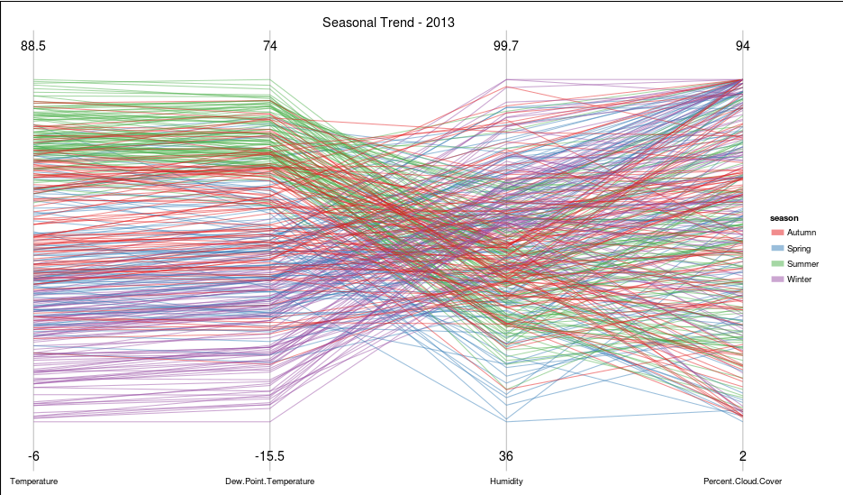

Project: Final
==============================


| **Name**  | Deeksha Chugh  |
|----------:|:-------------|
| **Email** | dchugh@dons.usfca.edu |

## Instructions ##
The following packages must be installed prior to running this code:
```
library(ggplot2)
library(ggmap)
library(maps)
library(randomForest)
library(RCurl)
library(GGally)     
```
To run this code, please enter the following commands in R:
```
library(shiny)
shiny::runGitHub('msan622', 'deekshachugh', subdir = 'final-project')
```
## Discussion ##

###Data Preparation ###
 
In order to do this analysis, I scraped the weather data from Wunderground website. The website provides the airport code and its weather information. I mapped the airport codes to get the city name and their latitude and longitude information. I also created a season column by using the months in the data. Please note that I did not use wind speed in my analysis as it has some abnormal values which is incorrect in my opinion.


###US Weather Overview - 54 Citites (2011-2013)###


The above plot shows the heatmap of temperature across 54 citites in US. Each dot is representative of each city. The color gradient is chosen to be yellow to red as it depicts low to high temperature. The dew point temperature has also the same gradient color. I changed the legend position inside the graph to have better data-ink ratio. The color of the map is also changed to black so that its easier to look at the graph for long hours. The plot title and the legend title are in bold with increased size so that it is easier to read. The alpha level of the dot is reduced to 0.8 to see the overlapping citites. I thought of adding the value of temperatures over the dots but it was not providing any extra information. The idea of the plot is to display holistic view of the data across US. I removed the background panel and made it white so that it merges with the whole application. I tried different sizes of the dots but decided with 9 as appropriate as its not very big and not very small.


The above plot shows the heatmap of Humidity across 54 citites in US. The color gradient is chosen to be light blue to blue as it depicts low to high humidity. 

#####Interactivity#####

On the left side of the panel, you can select any date withing the three years of date range to see the temperature accross all citites. 

The radio button is added for user to select the variable which they want to view. The variables included are Temperature, Dew Point Temperature, Humidity and Percent Cloud Cover. 

###City Temperature Overview ###


The multiline plot shows the temperature and dew point temperature over the range of 3 years for each city. I have chosen this technique becuase it is the best way to visualize the time series. 

#####Interactivity#####

The user can select any city from the list of citites by typing the city in the panel. I have used selectizeInput which allows the user to type and searches in the list to find the city of interest. The date range is also provided to the user so that if they want to zoom in and see a particular month or date within the specified time period.

Below is the graph showing the zoomed in version of the above plot.


###City Rainfall Overview ###


This plot displays the average rainfall of all the 54 citites along with the rainfall of a particular city for all the months in 2013. The light blue color is depicting the city rainfall and dark blue color is depicting the average rainfall.

#####Interactivity#####
The user can select any city for which they are interested in looking at the rainfall. 

### Seasonal Trend ###


The plot shows the seasonal trend of the city 

#####Interactivity#####
I used brushing to show a selected season in which user is interested. There are four seasons and the color is fixed for each of the color. If you want to see one season, you can de-select the others and it will become grey in color.

### Temperature Prediction  ###


I used a random forest, a machine learning technique to make a model which can predict temperature. The plot shows the temperature as well as its predicted temperature by a multiline plot.

#####Interactivity#####
The user can select any city for which they are interested in temperature prediction.