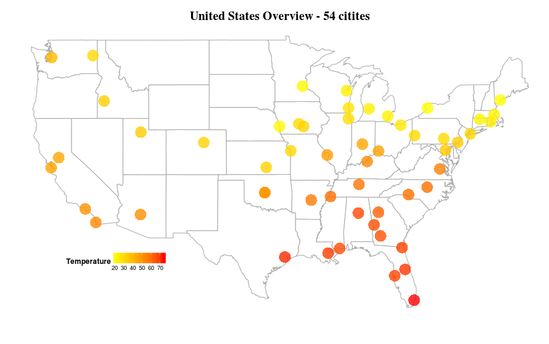

Project: Final
==============================


| **Name**  | Deeksha Chugh  |
|----------:|:-------------|
| **Email** | dchugh@dons.usfca.edu |

## Instructions ##
The following packages must be installed prior to running this code:
```
library(ggplot2)
library(ggmap)
library(maps)
library(randomForest)
library(RCurl)
library(GGally)     
```
To run this code, please enter the following commands in R:
```
library(shiny)
shiny::runGitHub('msan622', 'deekshachugh', subdir = 'final-project')
Please note that the data is fetched from online server so you need to have internet connected when you run this application.
```
## Discussion ##

###Data Preparation ###
 
In order to do this analysis, I scraped the weather data from Wunderground.com. The website provides weather information on the basis of airport code. I mapped the airport codes to get the city name and their latitude and longitude information. I also created a season column by using the months in the data. 

###Project Prototype###
I demonstrated a time series line chart of temperature and dew point temperature with zoomed in version and overview across three years.
Spencer and Prateek suggested me to use selectize input option in my UI becuase I have 54 cities in my data. I impelemented that option and it was really useful because you need not scroll for the city which you want to visualize instead you can type the city and it will show up. Jeremey, Manoj and Trevor all of them suggested to do some heat map visulaization by showing the geography and I was able to implement that my mapping the latitude and longitude of the citites and I am glad that they suggested this.

Trevor also suggested me to show seasonal information about the data. I added a parallel coordinate plot which shows various seasonal patterns in temperature and other weather variables.

I did not implement the outlier analysis suggested by Manoj as I wanted to focus on graphs which can give a bigger view of weather rather than a drilled down approach.


###Challenges###.

The biggest challenge for me was to implement brushing in my parallel coordinate plot. I fixed the colors of each season to make it consistent. The problem was that when I de-select any season in my plot then the lines which are grey appears on top of the solid lines which I want to show. I tried to set the alpha level also for the de-selected lines but it was not helpful. I was still not able to implement it. To reduce the effect of grey lines on my solid lines I reduced the alpha level for all the lines and made the grey lines more white in color. 
Another challenge was to get the city names mapping because my dataset had airport codes and I wanted to add city names instead of Airport Codes and that information is not available easily but I somehow managed to do it and added in my dataset.

The wind speed extracted from the wunderground.com had some really abnormal values like -1000 and so on which was really difficult to interpret. I made a lot of visulaizations with wind speed but those outliers were showing a totally odd story which was hard to believe. Therefore, I dropped that variable from my analysis as its better to show less but accurate information.

If I had more time, I would have implemented it in D3 with nice interativity wherein you can have a tooltip to see which point is what temperature or humitdity in all my plots. I think that would have been very useful from user point of view. I could have added more data like weekly flu trends or any product sales data and do some analysis on how temperature is related to it.


###US Weather Overview - 54 Citites (2011-2013)###




The above plot shows the heatmap of temperature across 54 citites in US. Each dot is representative of each city. The color gradient is chosen to be yellow to red as it depicts low to high temperature. The dew point temperature has also the same gradient color. I changed the legend position and direction to have better data-ink ratio. The color of the map is also changed to black so that its easier to look at the graph for long hours. The plot title and the legend title are in bold with increased size so that it is easier to read. The alpha level of the dot is reduced to 0.8 to see the overlapping citites. I thought of adding the value of temperature over the dots but it was not providing any extra information. The idea of the plot is to display holistic view of the data across US. I removed the background panel and made it white so that it merges with the whole application. I tried different sizes of the dots but decided with 9 as appropriate as its not very big and not very small. The lie factor is close to one for this plot. The data density is high in right part of my plot becuase I chose more cities from the east part of the country.

The latitude and longitude information of cities was required to generate this kind of plot. Its easy to find that information for states but it was difficult to find airport code mapping of lat-long. I somehow was able to find that information by secondary research.

I used melt from reshape library to covert this data into long format. The date column was a character column therefore, I also converted to date class so that it shows appropriate date. To show different city I am subsetting my data to use the city specific data of 3 years.


The above plot shows the heatmap of Humidity across 54 citites in US. The color gradient is chosen to be cyan to red. All the customizations applied on the above plot are also applied here.

#####Interactivity#####

On the left side of the panel, you can type any date within the three years of date range to see the temperature accross all citites. 
The radio button is added for user to select the variable which they want to view. The variables included are Temperature, Dew Point Temperature, Humidity and Percent Cloud Cover. 

###City Temperature Overview ###


The multiline plot shows the temperature and dew point temperature over the range of 3 years for each city. I have chosen this technique becuase it is the best way to visualize the time series. 

#####Interactivity#####

The user can select any city from the list of citites by typing the city in the panel. I have used selectizeInput which allows the user to type and searches in the list to find the city of interest. The date range is also provided to the user so that if they want to zoom in and see a particular month or date within the specified time period.

Below is the graph showing the zoomed in version of the above plot.


###City Rainfall Overview ###


This plot displays the average rainfall of all the 54 citites along with the rainfall of a particular city for all the months in 2013. The light blue color is depicting the city rainfall and dark blue color is depicting the average rainfall.

#####Interactivity#####
The user can select any city for which they are interested in looking at the rainfall. 

### Seasonal Trend ###


The plot shows the seasonal trend of the city 

#####Interactivity#####
I used brushing to show a selected season in which user is interested. There are four seasons and the color is fixed for each of the color. If you want to see one season, you can de-select the others and it will become grey in color.

### Temperature Prediction  ###


I used a random forest, a machine learning technique to make a model which can predict temperature. The plot shows the temperature as well as its predicted temperature by a multiline plot.

#####Interactivity#####
The user can select any city for which they are interested in temperature prediction.
