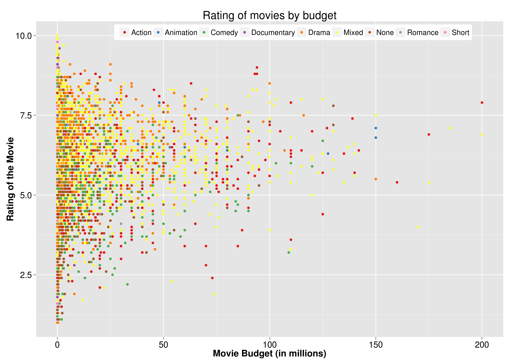
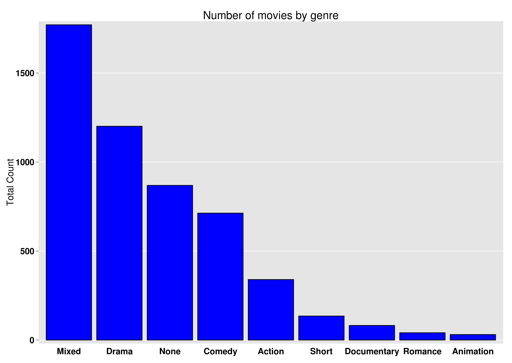
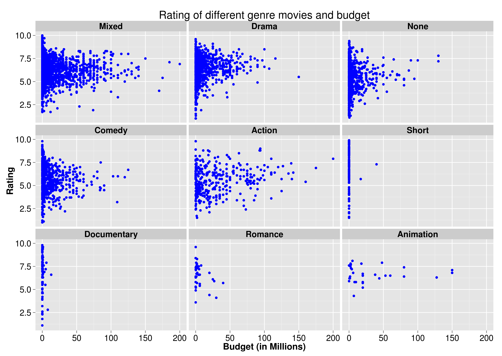
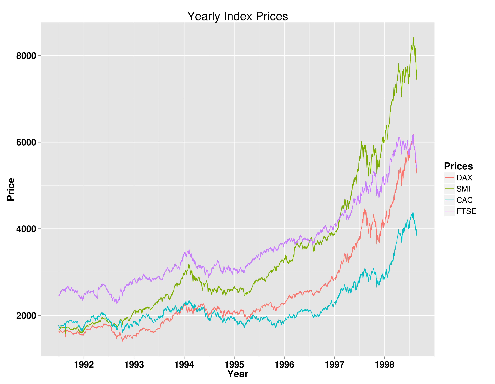

Homework 1: Basic Charts
==============================

| **Name**  | Deeksha Chugh |
|----------:|:-------------|
| **Email** | dchugh@usfca.edu |

## Instructions ##

The following packages must be installed prior to running this code:

- `ggplot2`
- `devtools`
- `reshape`

To run this code, please enter the following commands in R:

```
library(devtools)
source_url("https://github.com/deekshachugh/msan622/blob/master/homework1/Homework1.R")
```

This will generate 4 images. See below for details.

## Discussion ##


### Plot 1 ###



In the above plot, I changed the color of the text of the axes to black because the default grey color is very light. I also increased the size of the axis and the legend, and made the axes title bold. The budget is represented in millions to increase the readability of the graph. I used color blind friendly colors to depict the genre of the movies. I also changed the position and direction of the legend to decrease the amount of extra space taken by the legend.

### Plot 2 ###



I rearranged the genres in the decreasing order of their frequency to display the comparison between genres effectively. I filled the bars with blue color and outlined it with black to make it pleasing. I also increased the size of the axis and the legend, and made it bold similar to plot 1. I removed the ticks on the x axes as they are not useful in a bar chart. 

### Plot 3 ###



I converted the actual budget column into a new column budget in millions to increase the readability of the graph. and I changed the color of the graph to blue to be consistent with my previous graph. I also removed the legend because it was redundant as the title on each small plot is representative of its genre. I used strip.text.x feature to increase the size and color of the genres titles. I increased the sizes of the legend, title and axes in order to increase the readability.

### Plot 4 ###



In order to multiline plot charts, I converted the data using melt command from reshape library to have a column which contains all the index labels and time element and used ggplot color attribute to draw multiple lines.
I changed the x axis to show all the years present in the data. I increased the sizes of the legend, title and axes in order to increase the readability.

