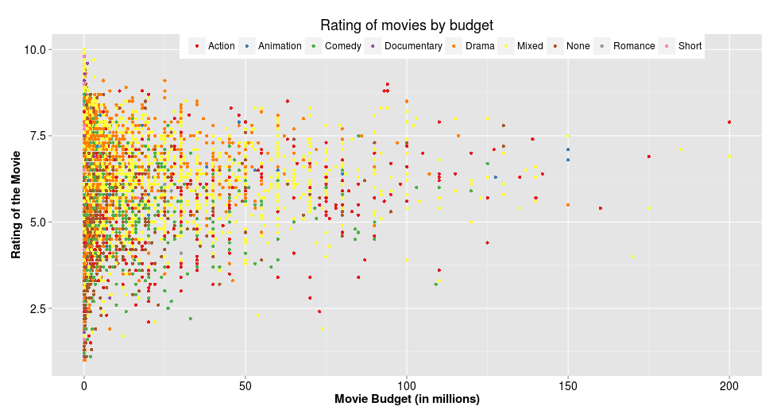

Homework 1: Basic Charts
==============================

| **Name**  | Deeksha Chugh |
|----------:|:-------------|
| **Email** | dchugh@usfca.edu |

## Instructions ##

The following packages must be installed prior to running this code:

- `ggplot2`
- `devtools`
- `reshape`

To run this code, please enter the following commands in R:

```
library(devtools)
source_url("https://github.com/deekshachugh/msan622/blob/master/homework1/Homework1.R")
```

This will generate 4 images. See below for details.

## Discussion ##


### Plot 1 ###



In the above plot, I changed the color of the text of the axes to black because the default grey color is very light. I also increased the size of the axis and the legend. The budget is represented in millions to increase the readability of the graph. I used color blind friendly colors to depict the genre of the movies. I also changed the position and direction of the legend to decrease the amount of extra space taken by the legend.

---------------------------------------

### Plot 2 ###


To display the comparison between genres effectively, I rearranged the genres in the decreasing order of their frequency . The bars are filled with blue and outlined with black to make it aesthetically pleasing. I also increased the size of the axis and the legend to make it easier to read. Ticks on the x-axis are not useful in a bar chart, therefore I removed them. I also changed the color of the text of the axes to black similar to the plot above.

---------------------------------------

### Plot 3 ###


The budget is represented in millions to increase the readability of the graph. I changed the color of the graph to blue to be consistent with my previous graph. I also removed the legend because it was redundant as the title on each small plot is representative of its genre. I used strip.text.x feature to increase the size and color of the genres titles. I increased the sizes of the legend, title and axes in order to increase the readability.

---------------------------------------

### Plot 4 ###


In order to plot multiline charts, I converted the data using melt command from reshape library to have a column that contains all the index labels and time element and used ggplot color attribute to draw multiple lines.
The scale_x_continuous feature of the ggplot was used for x-axis to display all the years present in the data. I increased the sizes of the legend, title and axes in order to increase the readability.

