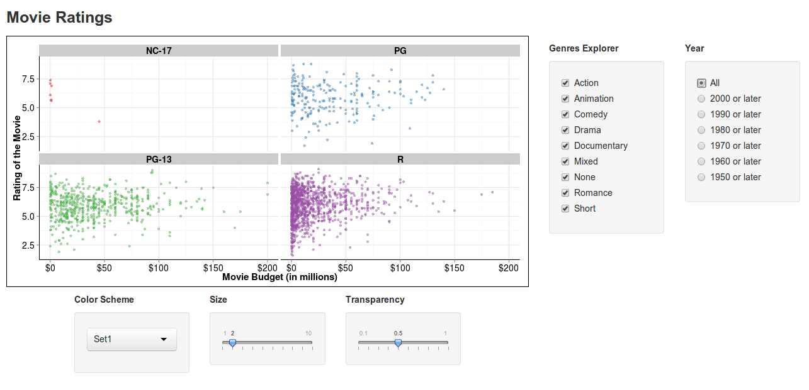

Homework 2: Interactivity
==============================

| **Name**  | Deeksha Chugh |
|----------:|:-------------|
| **Email** | dchugh@dons.usfca.edu |

## Instructions ##
The following packages must be installed prior to running this code:

- `ggplot2`
- `shiny`
- `scales`

To run this code, please enter the following commands in R:

```
library(shiny)
library(ggplot2)
library(scales)
shiny::runGitHub('msan622', 'deekshachugh', subdir = 'homework2')
```
Here is a screenshot of the app:



## Discussion ##

###User Interface ###
The above application plots the MPAA ratings of movies by budget.
I first plotted all the movies on a single plot, but there were too many overlapping points representing movies in it. To avoid that problem, I used multiple plots, one for each of the MPAA ratings.
The size and color of the heading of each of the multiplots was modified to increase readability.
To provide extra information, I added an extra radio button to show the year of the movie's release. This radio button helps the user to answer questions such as, "On average what is the budget of an action movie which was made after 1980's?". This also tells that NC-17 rating did not exist prior to year 2000 in the data.

The page has been laid out using `fluidrows` so that the user doesn't need to scroll to select any attribute. The layout made reflows for small screens as well. The headings of each of the components have been arranged outside the box and uses strong typeface. I also added step-size to the slider for `transparency`.

###Plot###
The y-axes in the plot were changed to millions with labels as dollors to increase readibility. I removed the legend since the title of the subplot specifies the MPAA rating that the graph is for. I also increased the size of the axes and made them black. I increased the size and color of the MPAA rating titles. Instead of using the default grey background, I used a white background. The panel.grid.major lines were chosen to be grey to help determine the movies' budget and rating easily.