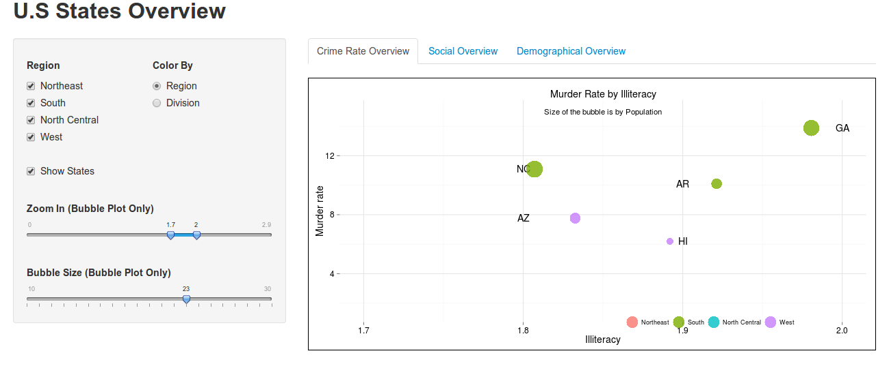

Homework [#]: Homework 3
==============================

| **Name**  | Deeksha Chugh  |
|----------:|:-------------|
| **Email** | dchugh@dons.usfca.edu |

## Instructions ##

The following packages must be installed prior to running this code:

`ggplot2`
`shiny`
`GGally`

To run this code, please enter the following commands in R:
```
library(shiny)
shiny::runGitHub('msan622', 'deekshachugh', subdir = 'homework3')
```

## Discussion ##

###Crime Rate Overview###

I was curious to know more about the illiteracy rate and its association with murder rate across all the states in U.S.. I chose bubble plot over Heatmap because certain attributes such as population, area of the state and other features can be shown using a Bubble Plot better.

The bubble plot displays murder rate, illiteracy rate and population for each state. It also maps which region each of the state belongs to. Each state is marked by its state code and its color represents its region.
The plot includes a slider to allow the user to change the size of the bubbles to make it visually appealing and more usable. 

Here is the screenshot of the visualization:


There are various ways in which the user can interact with this visualization:
* Color the bubbles by region or division.
* Filter based on the region.
* Zoom into the visualization by selecting the range of x-axis.
* Change the size of the bubbles using the slider.
* Show/hide state codes, as shown in the image below.


The visualization shows illiteracy rate by murder rate for different states and regions. The application provides the state code and the population of each state. Since some of the bubbles overlap, the application provides a framework to zoom, which is helpful in answering particular questions, such as "What was the illiteracy rate in CA?"


###Social Overview###

I was interested in looking at how few features are interlinked in just one plot. The scatter plot matrix provides a way to look at a lot of features in one visualization.  I included illiteracy, life expectancy, murder rate, and HS graduation because my hypothesis was that these should be highly dependent on each other. I colored the data points based on regions to provide a holistic view and help in deriving inferences.


The lower part of the matrix provides a view about how the various features are scattered. I changed the diagonal of the matrix to be the density of the features to get a rough idea about its distribution. The upper part of the scatter plot provides the actual correlation numbers. I have colored the points by division as well but since there are 8 divisions, it is a little hard to see in small plots. I extracted each of the ggplots from the ggpairs and appled customizations such as darkening the axes, changing the background from grey to white, etc.

Here is the screenshot of the visualization:


You can filter the regions and see the distribution of each of the regions for all the features.
I could not prvide the zoom feature as the different plots in the matrix have different regions.
By looking at the correlation values, we can see that life expectancy has the highest correlation with murder rate, followed by illiteracy and so on.


###Demographical Overview###

I chose this technique because it helps us to find patterns in our data with multiple features. I included population, area, income and frost level to show demographical overview of the US states. The lines in the plot are colored by regions or division, based on what the user selects. I tried using various scaling techniques on the data and found that `uniminmax` works best for this dataset. I removed the actual values and bound the data with just the limits. I removed the grid lines and changed the background to black as it is easier more appealing.


Here is the screenshot of the visualization:


Any of the regions and division can be selected by the input box on the left side. The plot shows us the relationship between population, area, frost, and income of the state. It shows that West region has high frost compared to South. We can see that there are few outliers in the dataset that have very high population, but very low area.