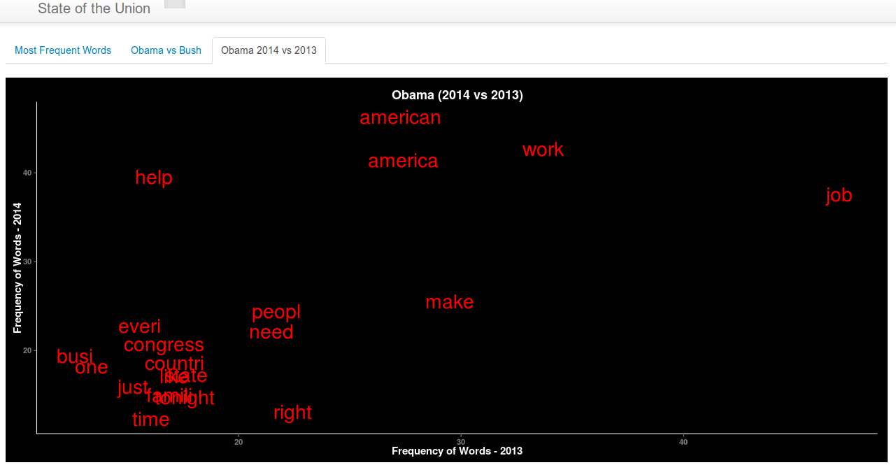

Homework [4]: Text Data Visualization
==============================

| **Name**  | Deeksha Chugh  |
|----------:|:-------------|
| **Email** | dchugh@dons.usfca.edu |

## Instructions ##

The following packages must be installed prior to running this code:
```
library(tm)       
library(SnowballC) 
library(tm)
library(ggplot2)
library(shiny)
```
To run this code, please enter the following commands in R:
```
library(shiny)
shiny::runGitHub('msan622', 'deekshachugh', subdir = 'homework4')
```

## Discussion ##

### Most Frequent Words (Obama and Bush) ###

Here is the screenshot of the visualization:

The above plot displays the most frequent words used by Bush and Obama in their speeches over the range of 4 years. I assigned the red color to Obama and green color to Bush and its consistent across whole all the visualizations. I removed the ticks, panel.grid, legend background. The background color was changed to black so that it is easier for people to look at the visualizations for long hours. The position of the legend was also adjusted on to the graph to save extra space.


### Obama Word Frequency(2013 vs 2014) ###

Here is the screenshot of the visualization:


The color of the words is red because I have assigned red color to Obama throughout all visualizations.
The size of the word is made bigger to increase readability. The background color is changed to black and all other axes text is changed to white color so that it is visible on black background. I removed the grid lines and added the major an dminor grid lines.

### Obama vs Bush ###

Here is the screenshot of the visualization:


The above plot show the difference between the words said by Obama and Bush. The plot also shows the words which are common in both of their speeches. The size of the word is showing the frequncy of the word. All the words which were frequent in Obama, in Bush and common in both were taken and their spacing was calculated so that they can be placed at a difference proportion to their frequency.
The color coding is preserved. The legend was arranged to save the space.

### PhraseNet -Obama(2014) ###

Here is the screenshot of the visualization:


Phrase-Net is used to represent Obama - State of the Union(2014) speeches at the link below:
http://www-958.ibm.com/software/data/cognos/manyeyes/visualizations/new/phrasenet/state-of-the-union-obama-2014/1

