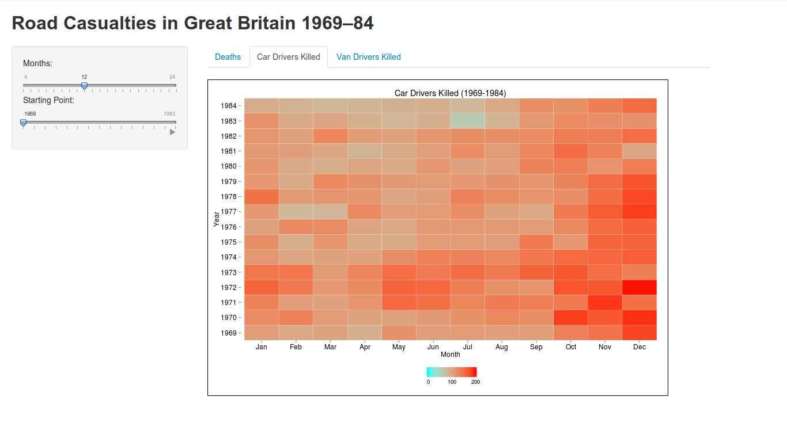

Homework [5]: Time Series Visualization
==============================

| **Name**  | Deeksha Chugh  |
|----------:|:-------------|
| **Email** | dchugh@dons.usfca.edu |

## Instructions ##
The following packages must be installed prior to running this code:
```
library(reshape) 
library(scales) 
library(ggplot2)
library(shiny)
library(grid)       
```
To run this code, please enter the following commands in R:
```
library(shiny)
shiny::runGitHub('msan622', 'deekshachugh', subdir = 'homework5')
```
## Discussion ##

###UK driver deaths###


The above plot shows the number of total driver deaths, front-seat passengers killed or seriously injured, and rear-seat passengers killed or seriously injured. The plot shows the sharp decline in number of deaths of front seat passengers after the law was introduced in 1983; however there is no effect on the number of deaths of back seat passengers.

The plot has two components. The upper part of the graph is the zoomed in version of the overview plot under it. The overview plot is a multiline plot showing the number of deaths. It also has an arrow which points to the time period when the seat belt law in UK was introduced. I changed the axes color to black and increased its size to increase readibility. The legend of the plot is moved on to the top of the plot to save space.

#####Interactivity#####

On the left side of the panel, you can play the starting point slider to see animated view over all the years. You could also select the number of months you want to view at any time.

###Car drivers killed###



The heatmap shows the number of car drivers killed in each of the years and months. Since red color is considered a sign of danger, a red color scheme is chosen to represent the number of deaths of car drivers. We can see a lot of light colored boxes after 1983 showing a decline in number of car drivers deaths. I changed the axes color to black and increased its size to increase readibility. The legend of the plot is moved on to the bottom of the plot and its direction is changed to horizontal.

The plot also shows a lot of dark red in the month of December, indicating a high number of deaths. It also shows that in the year 1977, during the months of February and March, the number of deaths drastically declined. This plot helps in identification of unusual trends in the data.

###Van drivers killed###


The above plot shows the number of van drivers killed during the years 1969-1984 in UK. I made a star plot -- it makes it easier to observe the that the area of the star is decreasing in the latter years. I initially tried a line plot, but it is hard to infer the above information using that. I changed the axes color to black and increased its size to increase readibility. The legend of the plot is removed as it is redundant. The title of the x-axis is also removed as it is pretty obvious from the graph.