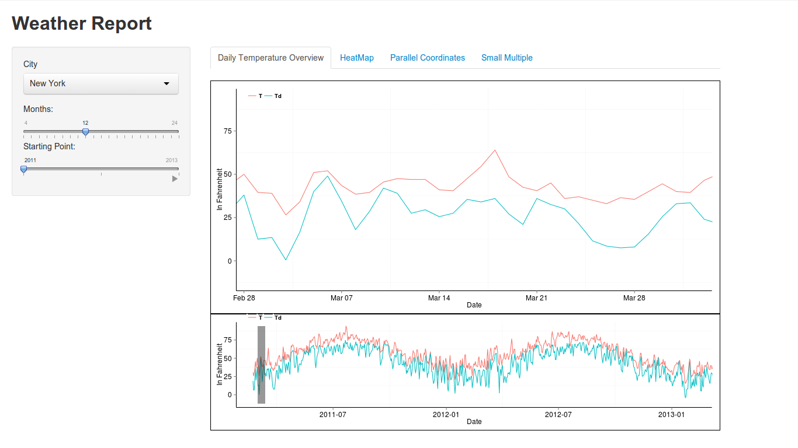

Project: Prototype
==============================

| **Name**  | Deeksha Chugh |
|----------:|:-------------|
| **Email** | dchugh@dons.usfca.edu |

## Discussion ##

###About Dataset###
The data contains the weather information including columns like temperature, dew point temperature, Humidity, Wind Speed and Precipitation for around 50 citites of USA.  

Here is the static image:

In this image, I am showing the daily temperature and overview of the total two years of temperature for New York.

Here is the prototype of my shiny application:

The prototype has the dropdown for various citites along with a slider to select which year and how many months the user want to look at a given time.