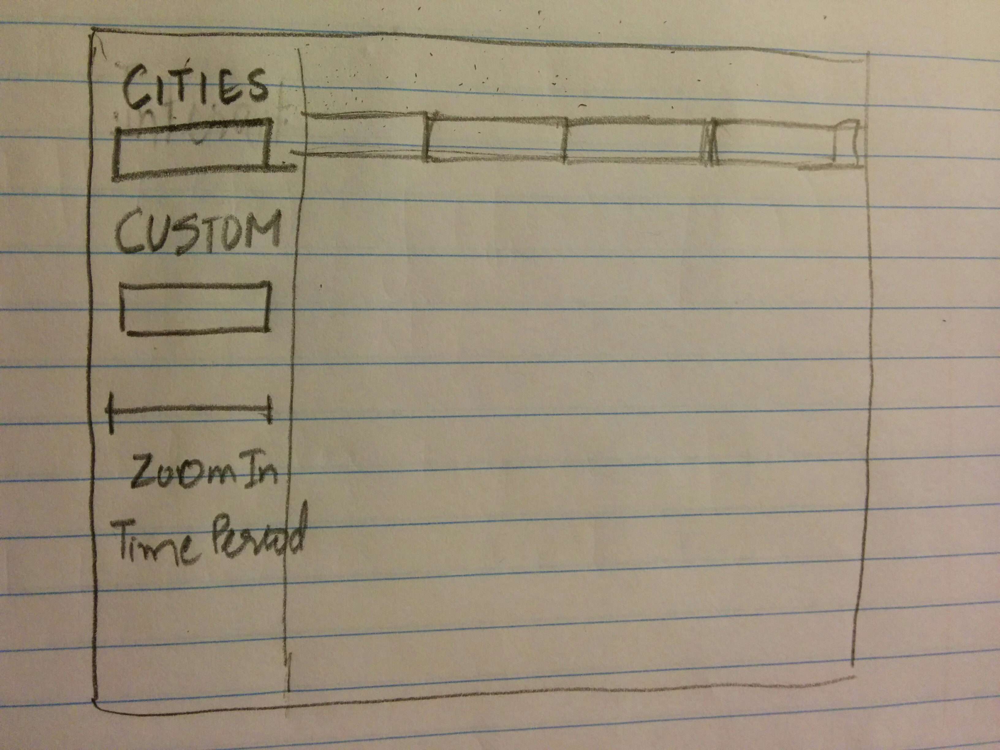

Project: Prototype
==============================

| **Name**  | Deeksha Chugh  |
|----------:|:-------------|
| **Email** | dchugh@dons.usfca.edu |

## Discussion ##

###Planned Tools###

I am definitely going to use Shiny, ggplot2, and R to visualize. I will use data manipulation libraries
such as reshape or plyr. It depends on the requirement at that time. I am also planning to use ggmap package.

###Planned  Techniques###

Here is the list of techniques I am planning to do:

1. Heat Map: I am planning to do the heat map of temperature for few of the citites of US present in my data.
I am planning to pick major cities of US.

2. Small Multiples: This plot will show the temperature for different months as small different plots. Other data columns like Humidity, precipitation can be added in the filtering.

3. Multiline Plot : This will contain the overview of the temperature, dew point temperature, wind, precipitation.
 Also, it will contain the zoom in feature to see a daily view.

4. Parallel Coordinate Plot: This will be very appropriate as I think we can find patterns in data about what is the general speed of wind when the temperature is high or low.

###Planned Interaction###

I am definitely going to implement filtering to give user an option on what cities they want to view for heatmap or parallel coordinate plot. For the multiline plot, I am planning to add zoomin feature to see a closer look at the changes of temperature and other variables.

###Planned Interface

Sorry, my hand writing is not that good.

